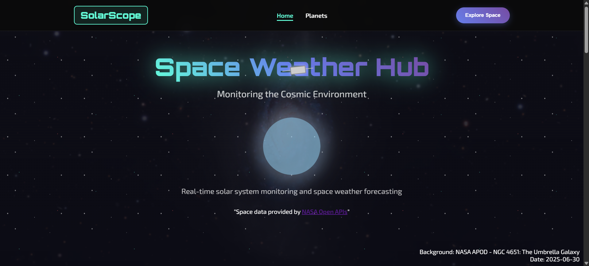

# space-weather-app

# 🚀 SolarScope – Your Space Weather Companion

> A modern, animated, real-time space weather web app powered by NASA's DONKI APIs, delivering alerts on solar flares, geomagnetic storms, and more – with interactive UI and beautiful animations.

---

## 🌐 Live Demo

[🔗 Click here to preview SolarScope](https://aman-toad.github.io/space-weather-app/)  

---

## ✨ Features

- 🔭 **Real-Time NASA Space Weather Data**
- 🌞 Live Solar Flares, GST (Geomagnetic Storm), and Aurora Forecasts
- 🛰️ ISS-style satellite animation floating across the screen
- 🌟 Glowing Sun animation with flare pulse effect
- 🎯 Lazy-load APIs with scroll-trigger (Intersection Observer)
- 📱 Fully Responsive Design for all screen sizes
- 💡 Optimized performance with minimal initial requests

---

## 🧰 Tech Stack

| Tech       | Description                         |
|------------|-------------------------------------|
| `HTML`     | Markup for structure                |
| `CSS`      | Custom + Animated styling           |
| `JavaScript` | Logic, API fetching, lazy loading  |
| `NASA APIs` | Real-time space weather data       |

---

## 🖼️ Homepage Preview

## 🤝 Credits
- NASA OPEN APIs
